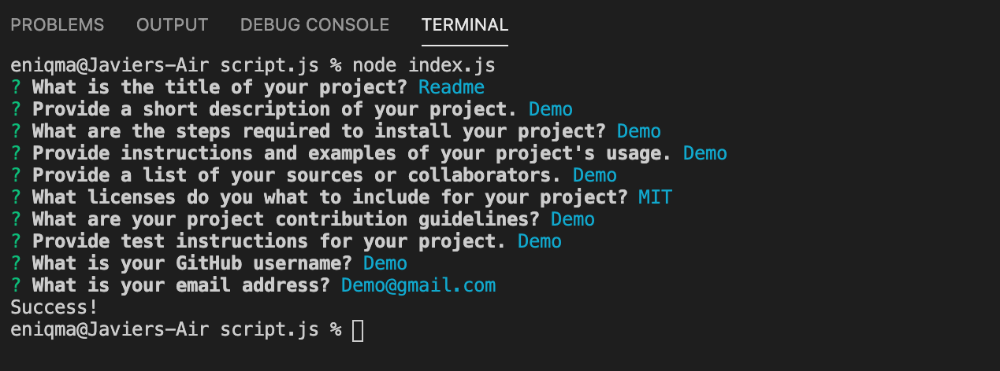
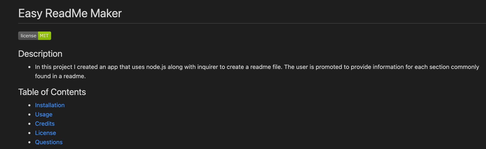

# Easy ReadMe Maker


## Description

<!-- Provide a short description explaining the what, why, and how of your project.
What was your motivation? Why did you build this project? What problem does it solve? What did you learn? -->

- In this project I created an app that uses node.js along with inquirer to create a readme file. The user is promoted to provide information for each section commonly found in a readme.

## Table of Contents

- [Installation](#installation)
- [Usage](#usage)
- [Credits](#credits)
- [License](#license)
  <!-- - [Contribute](#contribute) -->
  <!-- - [Tests](#tests) -->
- [Questions](#questions)

## Installation

<!-- What are the steps required to install your project? Provide a step-by-step description of how to get the development environment running. -->

- To install copy and paste either the SSH or HTTPS key and run it in either Bash (PC Users) or Terminal (MAC Users) using the git clone command.

```md
SSH key: git clone git@github.com:javierperez98/readmeMaker.git
HTTPS key : git clone https://github.com/javierperez98/readmeMaker.git
```

- Next you'll have to install all the required node modules by opening the index.js file using terminal/bash and typing in the following command.

```md
npm i
or
npm install
```

## Usage

<!-- Provide instructions and examples for use. Include screenshots as needed. -->

- The usages of this app is to provide you an easy an effortless readme for any project you may have.
- The readme templete follows the layout of what a professional readme should contain.
- This is what the app looks when you run it. Answer all the questions to create a readme.
  
- Once you create your readme, you will find it has a section for title, description and a tabel of contents that lets you jump to each section.
  

## Credits

<!-- List your collaborators, if any, with links to their GitHub profiles. Links to websites or resources. -->

- https://www.google.com
- https://shields.io/
- https://nodejs.org/en/docs/
- https://choosealicense.com/
- https://www.contributor-covenant.org/
- https://developer.mozilla.org/en-US/
- [Christian Payan](https://github.com/ChrisPayan)

## License

<!-- If you need help choosing a license, refer to https://choosealicense.com/ -->

MIT License

Copyright (c) 2021 [Javier Perez]

Permission is hereby granted, free of charge, to any person obtaining a copy
of this software and associated documentation files (the "Software"), to deal
in the Software without restriction, including without limitation the rights
to use, copy, modify, merge, publish, distribute, sublicense, and/or sell
copies of the Software, and to permit persons to whom the Software is
furnished to do so, subject to the following conditions:

The above copyright notice and this permission notice shall be included in all
copies or substantial portions of the Software.

THE SOFTWARE IS PROVIDED "AS IS", WITHOUT WARRANTY OF ANY KIND, EXPRESS OR
IMPLIED, INCLUDING BUT NOT LIMITED TO THE WARRANTIES OF MERCHANTABILITY,
FITNESS FOR A PARTICULAR PURPOSE AND NONINFRINGEMENT. IN NO EVENT SHALL THE
AUTHORS OR COPYRIGHT HOLDERS BE LIABLE FOR ANY CLAIM, DAMAGES OR OTHER
LIABILITY, WHETHER IN AN ACTION OF CONTRACT, TORT OR OTHERWISE, ARISING FROM,
OUT OF OR IN CONNECTION WITH THE SOFTWARE OR THE USE OR OTHER DEALINGS IN THE
SOFTWARE.

<!-- ## Contribute -->

<!-- If you created an application or package and would like other developers to contribute it, you can include guidelines for how to do so. -->

<!-- ## Tests -->

<!-- If your project has any tests provide examples on how to run them here. -->

## Questions

Contact me for any questions you might have.

- GitHub: [javierperez98](https://github.com/javierperez98)
- Email: javier21perez98@gmail.com
- LinkedIn: [javierperez98](https://www.linkedin.com/in/javier-perez98/)
